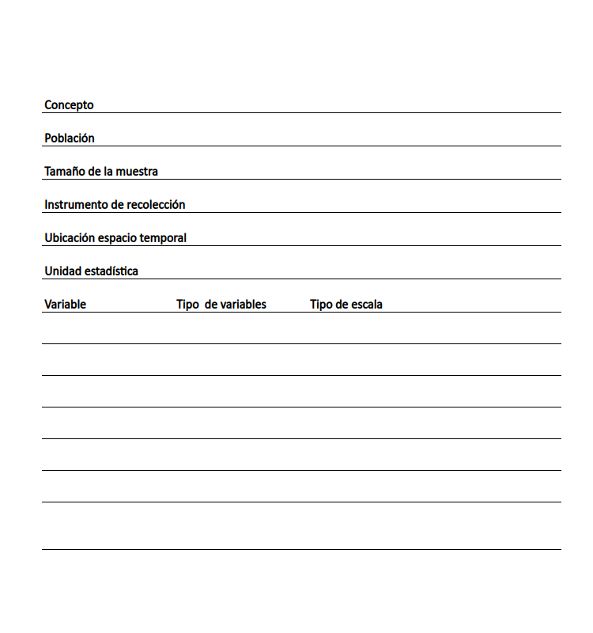

```{r setup, include=FALSE}
knitr::opts_chunk$set(echo = TRUE,comment = NA)
# colores
c0= "#b0394a"
c1= "#ad6395"
c2= "#a391c4"
c3= "#8acfe6"
c4= "#646420"
c5= "#db524f"

```


<br/><br/>

## **Ficha ténica**




