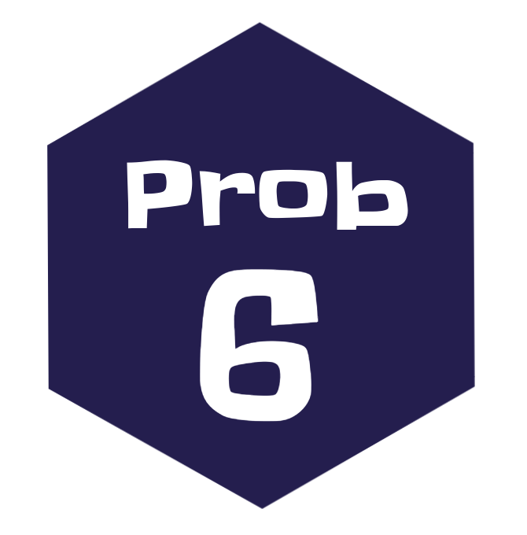

```{r setup, include=FALSE}
knitr::opts_chunk$set(echo = TRUE, comment = NA)
library(tidyverse)
#Colombia<- readRDS("data/Colombia.RDS")


# colores
c0= "#b0394a"
c1= "#ad6395"
c2= "#a391c4"
c3= "#8acfe6"
c4= "#646420"
c5= "#db524f"

library(summarytools)
```


</br></br></br>

```{r, echo=FALSE, out.width="10%", fig.align = "left"}
knitr::include_graphics("img/problema1.png")
```


#### **Probabilidad y mi vida** 

Las decisiones forman parte de nuestras vidas, dia a dia tomamos decisiones que afectan nuestro futuro, para tomarlas en algunas  ocasiones recurrimos a valorar el riesgo que  podrían tener. ¿ En tu vida has  tomado decisiones con información previa que te ha permitido valorar su riesgo?. o por el contrario tus decisiones han obedecido a corazonadas y sentimientos?. Esta pregunta solo es para reflexionar sobre el tema . No debes contestarla si no lo deseas.

</br></br></br>

```{r, echo=FALSE, out.width="10%", fig.align = "left"}
knitr::include_graphics("img/problema2.png")
```


#### **Lanzamiento de un dado** 

Un experimento consiste en lanzar un dado y observar el número de puntos en su cara superior. Algunos eventos aleatorios que se pueden definir a partir de este experimento pueden ser:

+ A: sacar 2
+ B: sacar un número par
+ C: sacar un número mayor a 2
+ D: obtener A y B
+ E: obtener A o B o ambos
+ F: obtener A y C 

</br>

+ Describa el espacio muestral asociado al experimento aleatorio
+ Liste cada uno de los eventos aleatorios A hasta F
+ Represéntelos mediante un diagrama de Ven
+ Determine en cada caso las probabilidades asociadas a cada evento aleatorio

</br></br></br>

```{r, echo=FALSE, out.width="10%", fig.align = "left"}

```


#### **Faltar a clases**

En un grupo de  100 estudiantes 30 residen por fuera de la ciudad, de los cuales 10 presentan altos niveles de inasistencia a clases, mientras que 35 de los que residen dentro en la ciudad también presentan altos niveles de inasistencia a clases.
	
+ Construya una tabla de probabilidades con la información anterior.
+ Represente también la información mediante un diagrama de Venn. 
+ Identifique dos eventos simples y dos eventos conjuntos En cada caso escriba en palabras la probabilidad y su resultado
+ ¿Se podría afirmar que residir en la ciudad y no tener altos niveles de inasistencia a clases son eventos independientes?


</br></br></br>

```{r, echo=FALSE, out.width="10%", fig.align = "left"}
knitr::include_graphics("img/problema4.png")
```


#### **Sobre costos en la construcción**

Una empresa de construcción local descubrió a través de una investigación que solo el 20\% de todos los trabajos son terminados a tiempo, mientras que el 30\% sufrían sobrecostos. Además, los sobrecostos se presentan en el 75\% de las veces en la que los trabajos se terminaron a tiempo.  Carlos, gerente de la empresa desea conocer que tan probable es que un proyecto no tenga sobrecostos y se termine a tiempo. Esto le permitirá tomar decisiones en caso de ser necesario. Ayude a Carlos a resolver su interrogante.


</br></br></br>

```{r, echo=FALSE, out.width="10%", fig.align = "left"}
knitr::include_graphics("img/problema5.png")
```

#### **Muertes por accidentes de transito** 

Se sabe que los accidentes de tránsito en su mayoria  ocurren durante la noche de los sábados y se deben  en un  65\% la ingesta excesiva de alcohol, un 25\% se deben a la imprudencia del conductor y el resto a otras causas, (fallo mecánico…etc.). En estos accidentes, el resultado es nefasto en el 30\% de las veces para el primer caso, un 20\% en el segundo y el 5\% en el tercero. Una empresa de salud que presta servicios de ambulancias quiere que Usted le ayude a pronosticar cuál es la causa del accidente más probable, sabiendo que este hecho ha tenido resultados nefastos. Con esta información la empresa pretende tomar decisiones sobre el equipamiento que deben tener sus vehículos, dando prioridad a los elementos relacionados con mayor probabilidad de ocurrencia. Ayude a la compañía de salud a establecer el orden de estas prioridades.  
	

</br></br></br>
```{r, echo=FALSE, out.width="10%", fig.align = "left"}

```


#### **Sistema de seguridad**: 

Uno de  los sistemas de seguridad de la universidad funciona mediante la conexión de cuatro componentes como se muestra en las figuras. Suponga que estos  componentes funcionan de manera  independientes y que la probabilidad de que falle cada uno de los componentes `R1`, `R2`, `R3`y `R4` son respectivamente: $0.10$, $0.05$, $0.10$ y $0.20$. Con el fin de tener la mejor composición de ellos, es decir la mayor confiabilidad de funcionamiento, el director de recursos físicos le pide a determine cuál es la mejor configuración del sistema.


```{r, echo=FALSE, out.width="60%", fig.align = "center"}
knitr::include_graphics("img/circuitos.png")
```

</br></br></br>

```{r, echo=FALSE, out.width="10%", fig.align = "left"}
knitr::include_graphics("img/problema7.png")
```


#### **Delincuentes adictos a las drogas** : 

Un estudio sobre la conducta de un gran numero de  delincuentes adictos a  las  drogas  hace pensar que la  probabilidad de  una  condena de dos años después del tratamiento podría depender del nivel de educación del  delincuente. Las  proporciones del numero total de casos que caen en  cuatro categorías de educación y condena se muestran en la tabla siguiente:
	
	
|  Educación      |                              |Condiciones dos años después del tratamiento	|
|:----------------|-----------------------------:|--------------------------------------------:|
			 
|	               |  Condenado  | No condenado | Totales         |
|:---------------|------------:|-------------:|----------------:|
|	10 años o más  |        0.10 |        0.30  |            0.40 |
| 9 años o menos |        0.27 |        0.33  |            0.60 |
|	Totales        |        0.37 |        0.63  |             1.00|

</br>

Suponga que se selecciona un  delincuente del programa de tratamiento y se esta interesado en  los siguientes eventos :
	
$A$: El delincuente tiene 10 años de educación o más

$B$: El delincuente es condenado dos años después de completar el tratamiento 

</br>
	
Encuentre las probabilidades para los eventos:

+ $A$
+ $B$
+ $A \cap B$
+ $A \cup B$
+ $A'$
+ $(A \cap B)'$
+ $(A \cup B)'$

	