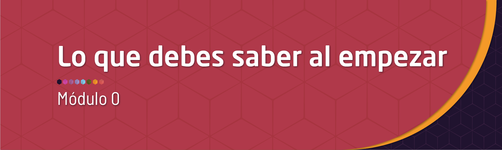

```{r setup, include=FALSE}
knitr::opts_chunk$set(echo = TRUE, message = FALSE, warning = FALSE, comment = NA)
library(psych)
library(summarytools)

# install.packages("devtools")
devtools::install_github("dgonxalex80/paqueteDEG")
library(paqueteDEG)

# colores
c0= "#b0394a"
c1= "#ad6395"
c2= "#a391c4"
c3= "#8acfe6"
c4= "#646420"
c5= "#db524f" 
# install.packages('gtools')
# install.packages("TeachingSampling")

#load library
library(gtools)
library(TeachingSampling)
library(readr)
base_muestreo <- read_delim("data/base_muestreo.csv", 
    delim = ";", escape_double = FALSE, col_types = cols(ID = col_integer()), 
    trim_ws = TRUE)

```


