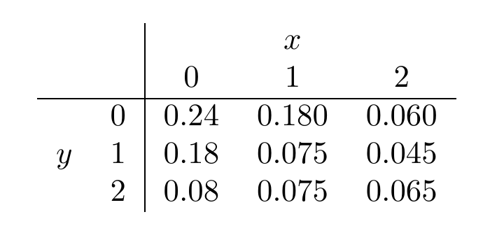

```{r setup, include=FALSE}
knitr::opts_chunk$set(echo = FALSE, comment = NA)
```

# Punto 1:
Un fabricante de bebidas azucardas tiene dos lineas simultaneas de producción que le permiten atender rapidamente los pedidos en menor tiempo. El llenado de latas en la linea1 es una variable aleatoria con distribución normal con media $355$ $ml$ y varianza $100$ $ml^{2}$ . Por otra parte el llenado de la linea2 se distribuye normal con media $357$ $ml$ y varianza $81$ $ml^{2}$ . Un cliente se queja que ha recibido un producto de baja calidad, debido a que en una venta realizada una lata de bebida solo tenia $338$ $ml$. El fabricante ha recibido y documentado el reclamo y decide realizar ajustes al proceso, revisando primero la linea más probable de ocasionar el problema. ¿Que linea debe revisar primero? . Justifique su respuesta.


# Solución: 

Información del problema

|                     |    línea 1    |    línea 2     |
|:--------------------|--------------:|---------------:|
| distribución llenado| $X_{1} \sim N(355, 100)$ | $X_{2} \sim N(357, 81)$    |

Se requiere determinar cúal de las dos lineas tiene una mayor probabilidad de :

$$P(X < 338) $$

```{r}
cat("P(X1 < 338) = ", pnorm(338,355,10))
```

```{r}
cat("P(X2 < 338) = ", pnorm(338,357,9))
```

De acuerrdo con los resultados obtenidos, se debe dar prioridad a la LINEA1 que tiene una mayor probabilidad de heber originado el incidente

<br/><br/><br/> <br/> 


# Punto 2:
El número de clientes (estudiantes y colaboradores) de la universidad) que se ubican en la caja registradora de la mercateria y el número de productos que compran constituyen dos  variables aletorias X y Y, respectivamente con función de distribución conjunta:
			
```{r, echo=FALSE, out.width="40%", fig.align = "center"}

```

Con el fin de estudiar el comportamiento delos  clientes de la mercateria, su Administrador le pide ayuda para determinar el grado de dependencia que tienen las dos variables


# Solución: 

```{r}
m= c(0.24,0.18, 0.08, 0.180, 0.075, 0.075, 0.060, 0.045, 0.065)
fxy=matrix(m, nrow = 3)
fxy=addmargins(fxy,c(1,2))
colnames(fxy)=c("0","1","2","h(y)")
rownames(fxy)=c("0","1","2","g(x)")
fxy
```


```{r}
fxy=as.table(fxy)
gx=fxy[1:3,4]
hy=fxy[4,1:3]
x=0:2
y=0:2

Ex=sum(x*gx)
Ex2=sum(x^2*gx)
Vx=Ex2-(Ex)^2
# 
Ey=sum(y*hy)
Ey2=sum(y^2*hy)
Vy=Ey2-(Ey)^2
# 
x=rep(x,each=3)
y=rep(y,3)
fxy=c(0.24,0.18, 0.08, 0.180, 0.075, 0.075, 0.060, 0.045, 0.065)
Exy=sum(x*y*fxy)
CovXY=Exy-Ex*Ey
Rho=CovXY/sqrt(Vx*Vy)
Rho
```

```{r}
cat("E(X)  = ", Ex, "\n")
cat("E(X2) = ", Ex2, "\n")
cat("V(X)  = ", Vx, "\n")
```


```{r}
cat("E(Y)  = ", Ey, "\n")
cat("E(Y2) = ", Ey2, "\n")
cat("V(Y)  = ", Vy, "\n")
```

```{r}
cat("E(XY)  = ", Exy, "\n")
cat("Cov(XY) = ", CovXY, "\n")
cat("Rho  = ", Rho, "\n")
```

El resultado indica que las variables presentan un bajo nivel de relación
